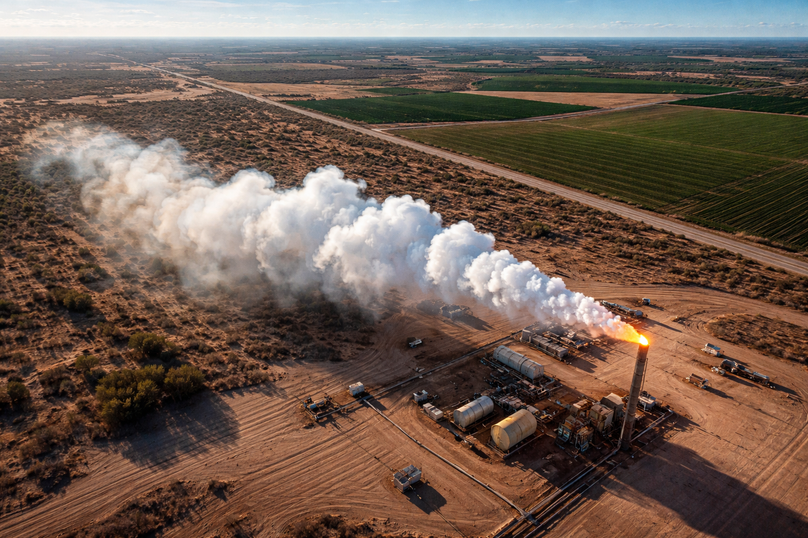
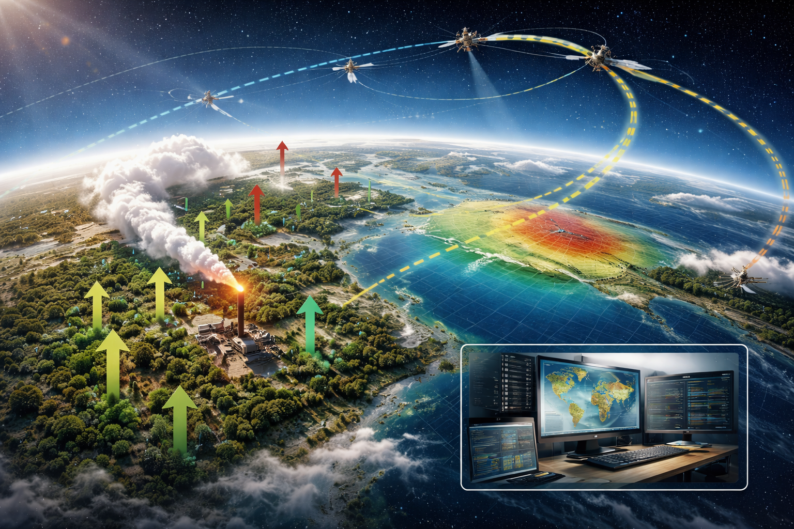
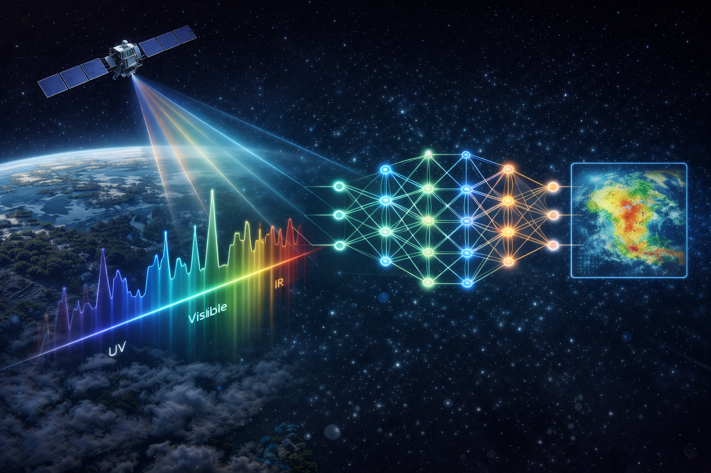

---
title: "Research"
---

ERSeLab develops remote-sensing methods and scientific analyses that turn Earth observations into reliable information about **greenhouse gases (CO₂, CH₄, and related species)** and the **carbon cycle**. We work across the full pathway—from instrument measurements to retrieval algorithms to interpretation—so our results are both scientifically rigorous and usable for climate research and mitigation.

## Research themes

### 1) Greenhouse-gas remote sensing
We improve the retrieval, validation, and interpretation of atmospheric greenhouse-gas observations from satellite and airborne instruments. A major emphasis is **bias control**, **uncertainty quantification**, and producing datasets that can be trusted for scientific and decision use.

**Topics include**
- Trace-gas retrieval theory and practice (CO₂, CH₄ and related products)
- Quality control, bias correction, and validation strategies
- Cross-sensor consistency and long-term stability

### 2) Retrieval algorithms and machine learning
We build **physics-informed** and **machine-learning** approaches that map measurements to geophysical quantities while retaining interpretability and uncertainty. We are interested in methods that scale to modern observing systems and enable robust downstream inference.

**Topics include**
- ML emulators and hybrid (physics + ML) retrieval architectures  
- Uncertainty-aware models, calibration, and out-of-distribution behavior  
- Efficient pipelines for large Earth-observation datasets  

### 3) Carbon-cycle variability and feedbacks
We use atmospheric observations and models to study how carbon sources and sinks change across seasons and years—especially in regions where climate variability can strongly modulate fluxes. We are particularly interested in the **tropics**, where climate–ecosystem interactions can drive large interannual variability.

**Topics include**
- Drivers of interannual variability in carbon fluxes  
- Links between climate anomalies and atmospheric greenhouse-gas signals  
- Evaluation of model–data consistency for carbon-cycle processes  

### 4) Inference and attribution
Observations become most valuable when they can be connected to causes. We use inversion and data-assimilation approaches to infer fluxes, attribute signals to processes/sources, and quantify confidence.

**Topics include**
- Atmospheric inversions for CO₂ and CH₄ fluxes  
- Attribution of enhancements to specific sources and regions  
- Methods for communicating uncertainty and decision-relevant metrics  

## Featured projects
```{=html}
<div class="card-grid">

  <div class="project-card">
    
    <h3><a href="projects/methane-plumes/">Methane Plumes</a></h3>
    <p class="muted">Detecting and characterizing methane point sources from satellite imagery, with robust uncertainty and validation.</p>
    <p>
      <span class="badge">CH₄</span>
      <span class="badge">Detection</span>
      <span class="badge">Attribution</span>
    </p>
  </div>

  <div class="project-card">
    
    <h3><a href="projects/carbon-inversion/">Carbon Inversion</a></h3>
    <p class="muted">Constraining carbon fluxes by combining atmospheric observations with transport models and data assimilation.</p>
    <p>
      <span class="badge">CO₂</span>
      <span class="badge">Inversions</span>
      <span class="badge">Carbon cycle</span>
    </p>
  </div>

  <div class="project-card">
    
    <h3><a href="../research/">Retrieval Algorithms</a></h3>
    <p class="muted">Physics-informed and ML retrieval methods, QA/QC, and uncertainty designed for downstream scientific inference.</p>
    <p>
      <span class="badge">Retrievals</span>
      <span class="badge">ML</span>
      <span class="badge">Uncertainty</span>
    </p>
  </div>

</div>
```

## Collaboration and open science
We collaborate widely across academia, agencies, and industry partners. We aim to share our work through publications, open tools, and reproducible workflows whenever possible.

If you’re interested in collaborating, data sharing, or joining the lab, please reach out via the **[Contact](../contact.qmd)** page.